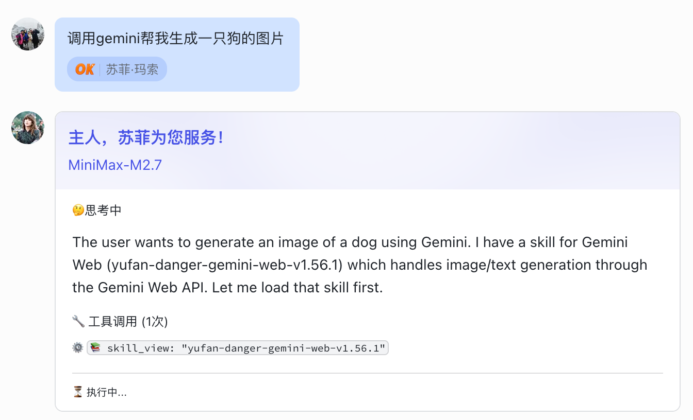
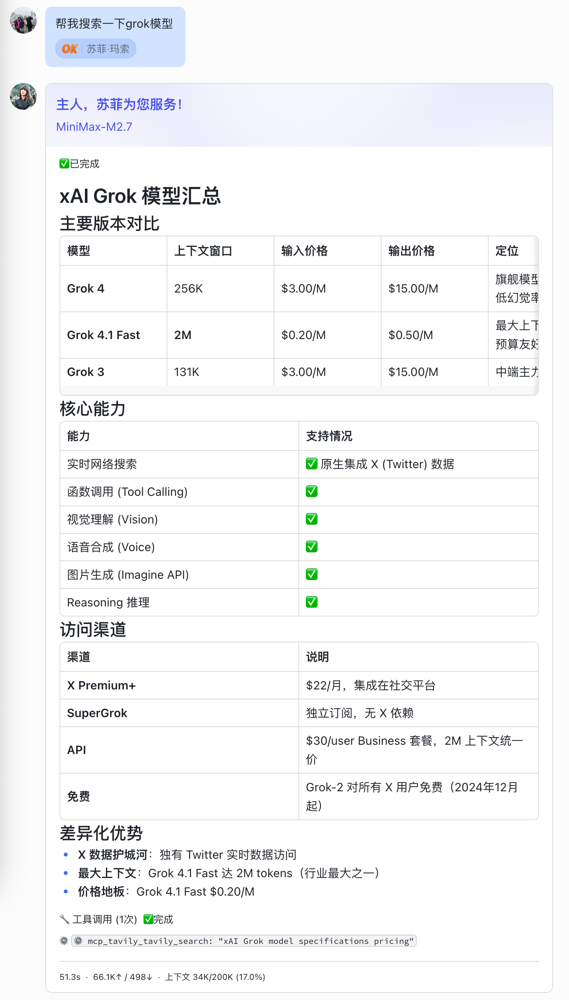

# Feishu Streaming Card for Hermes

为 [Hermes Gateway](https://github.com/joeynyc/hermes-agent) 添加飞书流式卡片消息支持。发消息给机器人后，卡片以打字机效果实时展示 AI 思考过程、工具调用和任务结果。

> English version: [README_en.md](README_en.md)

---

## 🤔 你是否也遇到过这些问题？

| 痛点 | 描述 |
|---|---|
| 🔴 **消息刷屏** | Agent 思考时飞书里蹦出一堆零散消息，夹杂思考碎片和工具日志，聊天记录被淹没 |
| 🔴 **焦虑等待** | 发出消息后界面毫无反应，不知道 Agent 是死是活、要等多久 |
| 🔴 **格式丢失** | Markdown 发到飞书变成纯文本，代码块、表格、列表全部乱成一团 |
| 🔴 **调试困难** | 工具调用状态不透明，不知道 Agent 在用哪个工具、处理到哪一步 |

## ✨ 一张卡片，全部解决

**Feishu Streaming Card** 将飞书消息升级为实时协作面板：

- 📌 **消息不刷屏** — 思考过程在同一张卡片内逐字更新，聊天记录干干净净
- ⏳ **状态一目了然** — 思考中 ⚡ → 执行中 → ✅已完成，每个阶段清晰可见
- 🎨 **原生格式保留** — Markdown 表格、代码块、列表直接渲染，不丢失样式
- 🔍 **工具透明** — 实时展示工具调用次数和内容，掌握 Agent 工作全貌
- 📊 **统计自动生成** — 用时、Token 消耗、上下文占用，底部 footer 一眼看清

| 特性 | 说明 |
|---|---|
| 🎯 卡片预创建 | 收到消息立即创建卡片，无需等待模型响应 |
| ⌨️ 打字机效果 | AI 思考过程逐字显示在卡片内 |
| 🔧 工具调用追踪 | 实时展示工具调用次数和内容 |
| 📊 Token 统计 | 底部显示用时、输入/输出 token、上下文占用 |
| 🔒 Sequence 并发保护 | asyncio.Lock 防止多协程更新卡片时的 sequence 冲突 |
| ⚙️ 配置简单 | 一行命令安装，配置文件控制所有参数 |

---

## 效果预览

| 思考中 | 已完成 |
|---|---|
|  |  |

**思考中** — 打字机效果实时展示 AI 推理过程，工具调用追踪中
**已完成** — 状态切换为 ✅，展示结果摘要和完整 token 统计

---

## 更新日志

### v2.1.0 (2026-04-16)
#### 文档更新
- 📋 **CardKit Token 获取详解**：补充 lark-cli 认证流程、token 刷新机制、常见错误处理
- 📋 **飞书 Bot 权限配置清单**：表格化快速检查清单，开通步骤一目了然
- 📋 **从飞书 CLI 安装**：独立章节强调 lark-cli 为必装依赖，提供完整认证命令

### v2.0.0 (2026-04-16)
#### 核心改进
- 🛡️ **安全安装流程**: 安装前先做语法校验 + 注入点验证，确认无误才写入文件
- 💾 **自动备份**: 每次安装前自动备份 feishu.py 和 run.py，保留最近 5 份
- ♻️ **一键恢复**: `installer.py --uninstall` 从最新备份恢复，`--restore BACKUP_ID` 恢复指定版本
- 🔍 **Dry-run 模式**: `installer.py --validate-only` 只校验不写入，方便 CI/测试

#### 补丁重写（feishu_patch.py / run_patch.py）
- 🔧 **版本感知注入**: 自动识别 Hermes 不同版本的 send() 结构，适配旧版和最新版 NousResearch/hermes-agent
- 🏷️ **greeting / model 动态读取**: 卡片标题和模型名从 config.yaml 实时读取，不再硬编码
- 🧵 **per-chat asyncio.Lock**: 每个聊天独立锁，序列化所有卡片更新，防止 code=300317 sequence 冲突
- ⏱️ **pending 超时兜底**: 卡片创建超时 30s 后自动降级为普通消息，不卡死对话
- 📝 **Agent footer 彻底移除**: thinking_content 正文不再混入 Agent footer 残留

#### Bug 修复
- 🐛 SEND_STREAMING_PRELUDE 缩进修复（12格→8格），解决 IndentationError
- 🐛 send() 注入点定位修复
- 🐛 Agent regex 缩进修复
- 🐛 run_patch.py 注入点修复
- 🐛 installer 误判"已安装"逻辑修复：改用 `"Feishu Streaming Card routing"` 强判断，防止半注入状态被跳过

### v1.1.0 (2026-04-15)
- ✨ **支持最新版 Hermes** (commit `da8bab7`): 重写 patch 引擎，适配 NousResearch/hermes-agent 最新版代码结构 (send() 方法签名变化)
- 🔧 **版本自动检测**: `installer.py --check` 自动识别目标 Hermes 版本，已安装则跳过
- 🐛 修复: Agent footer 不再混入 thinking_content 正文

### v1.0.0 (2026-04-15)
- 🎉 首发版本
- 流式打字机卡片、工具调用追踪、Token 统计 footer

---

## 环境要求

- Python 3.9+
- [hermes-agent](https://github.com/joeynyc/hermes-agent) 已安装
- 飞书 Bot 已配置好（WS 长连接模式）
- 依赖包：`pyyaml`、`regex`

---

## 飞书 Bot 权限配置

流式卡片依赖飞书 CardKit API 和 IM 消息接口，Bot 需要以下权限和配置。

### 快速检查清单

| 步骤 | 操作 | 状态 |
|------|------|------|
| 1 | 开通 Bot 能力 | ⬜ |
| 2 | 申请 `im:message` + `im:message:send_as_bot` + `cardkit:card` 权限 | ⬜ |
| 3 | 开启 WebSocket 长连接模式 | ⬜ |
| 4 | 添加 CardKit 应用能力 | ⬜ |
| 5 | 安装并认证 lark-cli（必装） | ⬜ |
| 6 | 在 `.env` 中配置 `FEISHU_APP_ID` + `FEISHU_APP_SECRET` | ⬜ |

---

### 1. 开通 Bot 能力

在 [飞书开放平台](https://open.feishu.cn/) → 你的应用 → **添加应用能力** → 选 **机器人**

### 2. 配置权限

进入 **订阅消息 → 权限管理**，申请以下权限：

| 权限 | 用途 |
|---|---|
| `im:message` | 发送卡片消息到聊天 |
| `im:message:send_as_bot` | 以机器人身份发消息 |
| `cardkit:card` | 创建和更新 CardKit 卡片 |
| `tenant_access_token` | 调用 APIs 获取 tenant access token |

> 权限申请后需要等待审核通过（通常几分钟~几小时）。

### 3. 开启长连接模式

→ 应用 → **消息订阅** → 订阅方式 → 选 **长连接（WebSocket）**

### 4. 启用 CardKit

→ 应用 → **添加应用能力** → 搜索 **CardKit** → 开启

### 5. 安装并认证 lark-cli（⭐ 必装）

流式卡片每次更新卡片内容都需要 fresh `tenant_access_token`，必须通过 lark-cli 获取。

```bash
# 安装 lark-cli（全局）
npm install -g @larksuite/oapi-cli

# 认证（交互式，需要 App ID 和 App Secret）
lark-cli auth login
```

认证过程会提示输入：
```
? App ID: cli_xxxxxxxxxxxxxxxx
? App Secret: [hidden]
```

**App ID 和 App Secret 获取位置**：
- 飞书开放平台 → 你的应用 → **凭证与基础信息** → `App ID` 和 `App Secret`

### 6. 验证 lark-cli 认证成功

```bash
lark-cli api POST /open-apis/auth/v3/tenant_access_token/internal \
  --data '{"app_id":"你的app_id","app_secret":"你的app_secret"}'
```

期望返回：
```json
{
  "code": 0,
  "tenant_access_token": "t-token-xxxxxxxxxxxx",
  "expire": 3600
}
```

> ⚠️ `tenant_access_token` 有效期为 **2 小时**，重启机器后需要重新 `lark-cli auth login`。

---

## CardKit Token 获取详解

流式卡片的核心机制：

```
用户发消息 → run.py 立即创建卡片 → AI 思考过程逐字更新到卡片 → Agent 完成卡片固定
```

每次更新卡片内容（thinking_content、tools_body 等）都需要调用飞书 CardKit API：

```
PUT https://open.feishu.cn/open-apis/cardkit/v1/cards/{card_id}
Authorization: Bearer {tenant_access_token}
```

### Token 获取方式（通过 lark-cli）

```bash
# 方式一：交互式（安装时推荐）
lark-cli auth login

# 方式二：直接调用验证
lark-cli api POST /open-apis/auth/v3/tenant_access_token/internal \
  --data '{"app_id":"你的app_id","app_secret":"你的app_secret"}'
```

返回的 `tenant_access_token` 会缓存在 `~/.lark-cli/auth.json`（Linux/Mac）或 `%USERPROFILE%\.lark-cli\auth.json`（Windows），后续调用自动使用。

### Token 刷新机制

| 情况 | 处理方式 |
|------|---------|
| token 过期（2小时） | 重新 `lark-cli auth login` |
| 重启机器后 | 重新 `lark-cli auth login` |
| 认证文件被删除 | 重新 `lark-cli auth login` |

### 常见认证错误

| 错误信息 | 原因 | 解决方法 |
|----------|------|----------|
| `401 Unauthorized` | App ID 或 App Secret 错误 | 检查凭证是否正确 |
| `403 Forbidden` | Bot 权限不足 | 确认 `cardkit:card` 权限已审核通过 |
| `无效的token` | token 过期 | 重新 `lark-cli auth login` |
| `command not found: lark-cli` | 安装失败 | `npm install -g @larksuite/oapi-cli` 重装 |

---

## 安装

### 从 GitHub 拉取（推荐）

```bash
# 1. 克隆项目
git clone https://github.com/baileyh8/hermes-feishu-streaming-card.git ~/github/hermes-feishu-streaming-card

# 2. 进入目录
cd ~/github/hermes-feishu-streaming-card

# 3. 安装依赖
pip install -r requirements.txt

# 4. 一键安装
python installer.py --greeting "主人，苏菲为您服务！"

# 5. 重启 Hermes Gateway
cd ~/.hermes/hermes-agent && source venv/bin/activate
python -m hermes_cli.main gateway restart
```

`--hermes-dir` 可指定 hermes-agent 路径（默认：`~/.hermes/hermes-agent`）。

安装流程（5步自动完成）：

| 步骤 | 内容 |
|------|------|
| 1/5 | 检查 prerequisites（pyyaml、regex） |
| 2/5 | 预检验证（注入点 + 语法检查） |
| 3/5 | 自动备份 feishu.py / run.py |
| 4/5 | 写入补丁 |
| 5/5 | 语法检查确认 |

### Dry-run（不写入）

```bash
python installer.py --validate-only
```

只校验注入点和语法，不写入任何文件。适合测试环境验证兼容性。

### 安装后检查

```bash
python installer.py --check
```

逐项检查 9 个注入点，输出每项状态（✓/✗）。

### 备份与恢复

```bash
# 列出所有备份
python installer.py --list-backups

# 从最新备份恢复（相当于卸载补丁）
python installer.py --uninstall

# 从指定备份恢复
python installer.py --restore 20260416_085616

# 恢复后重启生效
cd ~/.hermes/hermes-agent && source venv/bin/activate
python -m hermes_cli.main gateway restart
```

备份存储在 `~/.hermes/hermes-agent/.fsc_backups/{timestamp}/`，保留最近 5 份，每次安装自动触发。

---

## 配置

安装后，在 `~/.hermes/hermes-agent/config.yaml` 中添加或修改：

```yaml
feishu_streaming_card:
  # 卡片标题 — 机器人名字和问候语
  greeting: "主人，苏菲为您服务！"

  # 是否启用流式卡片（false = 使用普通消息）
  enabled: true

  # 等待卡片创建的超时时间（秒）
  # 模型初始化较慢时建议调大
  pending_timeout: 30
```

---

## 重启 Hermes

```bash
cd ~/.hermes/hermes-agent
source venv/bin/activate
python -m hermes_cli.main gateway restart
```

---

## 工作原理

```
用户发消息
  ↓
run.py: 立即调用 send_streaming_card() 创建卡片
  ├─ header: greeting + model
  ├─ thinking_content: "⏳ 执行中..."
  ├─ status_label: "🤔思考中"
  ├─ tools_label: "🔧 工具调用 (0次)"
  ├─ tools_body: "⏳ 等待开始..."
  └─ footer: "⏳ 执行中..."
  ↓
流式文本到达 → edit_message → send()
  └─ 写入 thinking_content（覆盖模式，打字机效果）
  ↓
工具调用到达 → send()
  ├─ status_label: "⚡执行中"
  ├─ tools_label: "🔧 工具调用 (N次)"
  └─ tools_body: 工具日志
  ↓
Agent 完成 → finalize_streaming_card()
  ├─ status_label: "✅已完成"
  ├─ thinking_content: result_summary
  ├─ tools_label: "🔧 工具调用 (N次)  ✅完成"
  └─ footer: token 统计
```

---

## 已知限制

1. **卡片创建延迟**：模型初始化约需 10-30s，此期间卡片显示初始状态
2. **CardKit PUT 限制**：仅支持根级 `markdown`/`plain_text`/`lark_md` 元素更新，不支持嵌套结构
3. **图片/视频附件**：图片等 MEDIA 附件会作为普通消息发出，不在卡片内

---

## 文件结构

```
hermes-feishu-streaming-card/
├── README.md                    # 本文件（中文）
├── README_en.md                 # English version
├── installer.py                 # 一键安装脚本（v2.0.0）
├── requirements.txt             # Python 依赖
├── config.yaml.example          # 配置示例
└── patch/
    ├── __init__.py
    ├── feishu_patch.py          # feishu.py 补丁
    └── run_patch.py             # run.py 补丁
```

---

## 故障排查

### Gateway 启动失败

```bash
# 1. 先看具体报错
cd ~/.hermes/hermes-agent
source venv/bin/activate
python -m hermes_cli.main gateway start 2>&1
```

| 报错信息 | 原因 | 处理办法 |
|----------|------|----------|
| `IndentationError` | 补丁注入后有缩进错误 | `python installer.py --restore` 恢复备份，然后重装 |
| `SyntaxError` | feishu.py / run.py 语法错误 | `python installer.py --check` 检查，或恢复备份 |
| `ModuleNotFoundError: No module named 'xxx'` | 缺少依赖包 | `pip install -r ~/github/hermes-feishu-streaming-card/requirements.txt` |
| `ImportError` feishu_patch / run_patch | patch 文件路径问题 | 确认在正确目录运行 installer |
| 卡住不动，无输出 | lark-cli 认证过期 | 重新 `lark-cli auth login` |

**快速恢复（不排查直接恢复）：**
```bash
cd ~/github/hermes-feishu-streaming-card
python installer.py --uninstall    # 从最新备份恢复
cd ~/.hermes/hermes-agent && source venv/bin/activate
python -m hermes_cli.main gateway restart
```

---

### 卡片没有出现？

```bash
# 检查补丁状态
python installer.py --check

# 查看日志
tail -f ~/.hermes/logs/agent.log | grep -i "feishu\|streaming\|card"
```

### Sequence 冲突错误（300317）？

确保 hermes-agent 是最新版本，旧版本可能缺少必要的锁机制。

### 卡片标题/状态不更新？

检查飞书 Bot 是否使用 WebSocket 长连接模式（WS 模式才支持 CardKit 更新）。

---

## License

MIT
